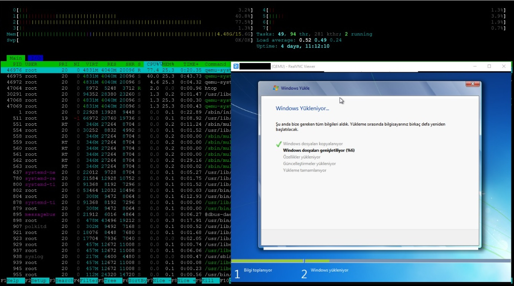

# 🖥️ QEMU Windows VM in Docker with VNC Access

This project allows you to run a lightweight, isolated Windows virtual machine using **QEMU inside a Docker container**, with **VNC remote desktop access**. It is useful for testing, sandboxing, or serving GUI-based environments remotely.

---

## 📦 Features

- Full Windows VM with VirtIO drivers
- QEMU-based virtualization
- VNC access over configurable ports
- Parametric CPU, RAM, and Disk configurations
- Base QCOW2 image support for efficient disk usage
- Volume-based persistent disk
- Easy-to-use `docker-compose` deployment

---

## ⚙️ Requirements

- Docker
- Docker Compose
- Host system that supports KVM/QEMU (Linux recommended)

---

## 🚀 Getting Started

### 1. Clone the Repository

```bash
git clone https://github.com/cynegeirus/winbox-docker.git
cd winbox-docker
````

### 2. Prepare ISO Images

Place your Windows installation ISO and VirtIO ISO files into the `iso/` directory:

```
iso/
├── os.iso         # Windows ISO
└── virtio.iso     # VirtIO drivers ISO
```

> You can rename them if needed, just update the Dockerfile or `main.sh` accordingly.

---

## 🔧 Configuration

You can modify the following environment variables inside `docker-compose.yml` or `.env`:

```yaml
environment:
  - CPU=2              # Number of CPU cores
  - RAM=4G        # RAM in megabytes
  - DISK_SIZE=20G      # Virtual disk size
  - VNC_PORT=5903      # VNC port to expose
```

---

## 🧪 First-Time Setup

To build and start the virtual machine:

```bash
docker-compose up -d --build
```

> The first run will create the disk image and start the Windows installation.

---

## 🖥️ Access the VM

Use any VNC client to connect:

```
Host: <your-host-ip>
Port: <VNC_PORT> (default 5901)
```



---

## 💾 Persistent Storage

The virtual machine disk is stored in a named Docker volume or host path (`/machines/` inside the container). You can mount it from the host or export it for backup.

---

## 🧠 Advanced Features

* **Base Image Layering**: Use `qemu-img` with `-b base.qcow2` to create differential VM disks.
* **Multiple VMs**: Scale up using `docker-compose --scale machine=n` with different ports.

---

## 📁 Project Structure

```
.
├── Dockerfile         # QEMU + VNC setup
├── docker-compose.yml
├── main.sh            # VM startup script
├── iso/               # Directory for ISOs
└── vm/                # (optional) disk storage
```

---

## ⚠️ Warnings

* Do **not** mount the same QCOW2 disk in multiple VMs for read-write.
* Base QCOW2 files must remain **unchanged** once overlay disks are created.
* Ensure host system supports KVM and nested virtualization.

---

## 📜 License

This project is licensed under the [MIT License](LICENSE). See the license file for details.

---

## 🙌 Issues, Feature Requests or Support

Please use the Issue > New Issue button to submit issues, feature requests or support issues directly to me. You can also send an e-mail to akin.bicer@outlook.com.tr.
